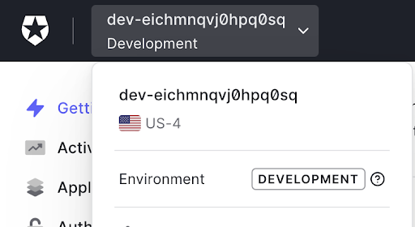
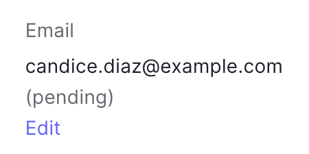

# Setup

Perform these steps before starting the module. 

## Sign up for a free Auth0 account 

1. Visit [auth0.com](https://www.auth0.com) and click the **Sign up** button. 
1. Enter an email address, create a password, and complete any other required steps. 
1. Check your email for the account verification link, and verify your account.
1. Take note of your Auth0 tenant name located in the upper left corner of the [Auth0 Dashboard](https://manage.auth0.com).

## Create test users

Set up two test users for use in the lab. 

1. Visit the [Auth0 Dashboard](manage.auth0.com).
1. In the sidebar on the left side of the page, navigate to **User management > Users**.
1. Click the **+ Create User** button.
1. Enter the username and password below. Leave the default Connection, "Username-Password-Authentication". This determines where the users are stored – the default Auth0 database is fine for this lab. Click the **Create** button.

        Username: candice.diaz@example.com
        Password: TestPW123!! 

1. Notice that the **Email** field is listed as pending. This means that the user has not clicked a verification link in their email.  
      
    Click **Edit** and then **Set email as verified** to change the status to verified. 

    

2. Click **Back to Users** and then the **+ Create User** button in the upper right. Create another user with the following credentials, again using the default Connection. 
   
        Username: aron.larson@example.com
        Password: TestPW123!!  

3. Leave this user's email as pending. Do not change it to verified. 

## Read the instructional notes

### Topic
This module is about Auth0 Actions, an Auth0 product feature that allows developers to extend their Auth0 implementation with custom code.

### Intended Audience
This lesson is targeted at software engineers who are not familiar with Auth0. 

### Prerequisite Knowledge
This activity assumes JavaScript skills as well as an understanding of basic technical concepts – web development, applications, APIs, etc.

### Learning Objectives
By the end of this module, participants will be able to:
1. Describe use cases for Auth0 Actions
2. Create and deploy an Action 

### Other notes
1. It is not a security best practice to provide identical passwords for all learners. Ideally, a password generator could provide unique passwords for each learner. 
2. In the "Apply your knowledge" section, a solution is provided. In a lab environment, a test could be set up to check it automatically.
