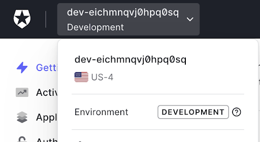
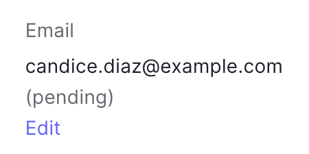
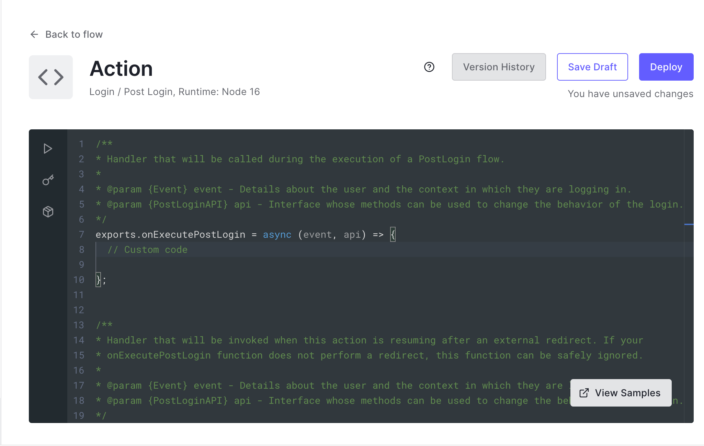
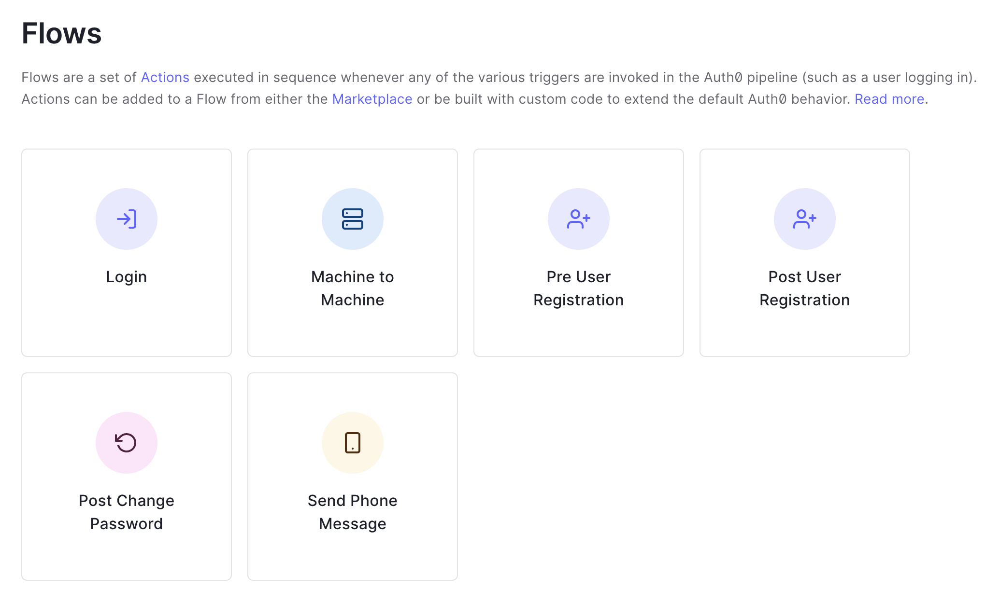
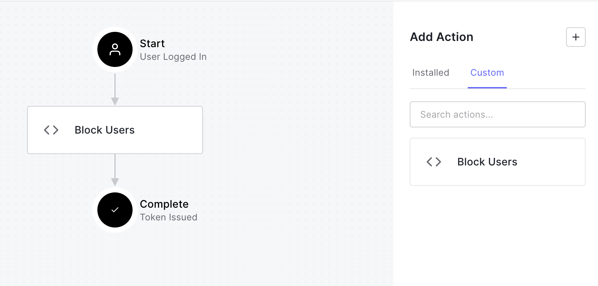
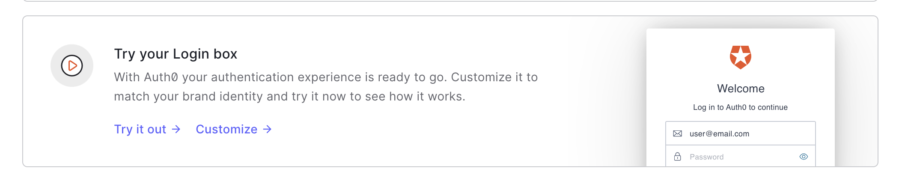
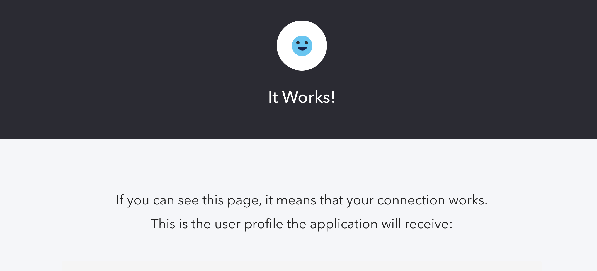
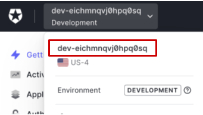
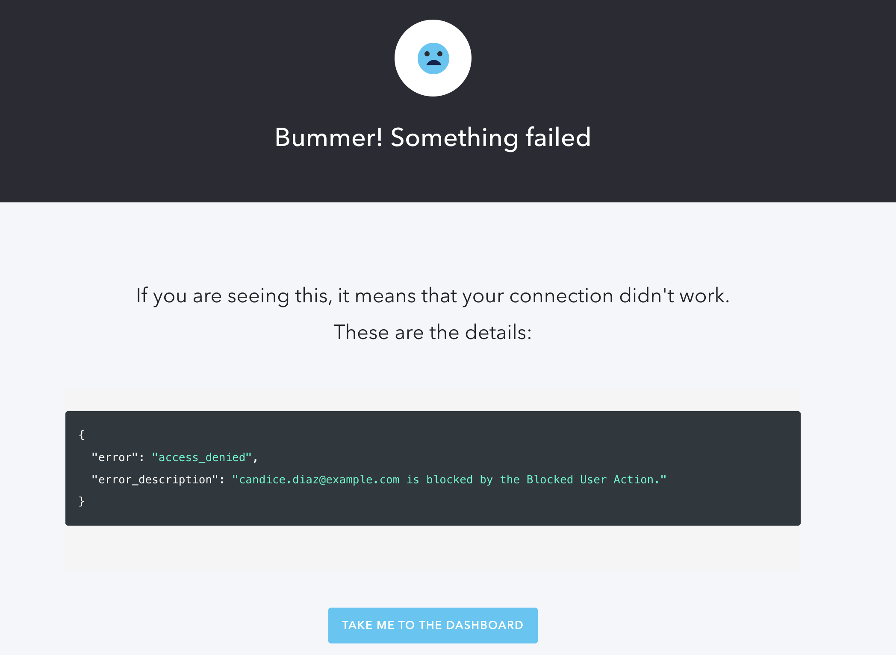
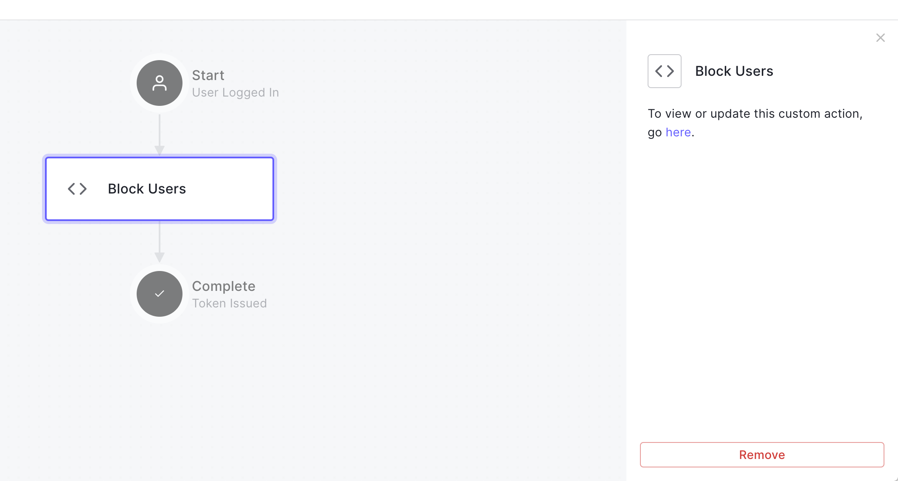

- [Setup](#setup)
  - [Sign up for a free Auth0 account](#sign-up-for-a-free-auth0-account)
  - [Create Test Users](#create-test-users)
  - [Instructional notes](#instructional-notes)
- [Training Module: Extend and Customize with Auth0 Actions](#training-module-extend-and-customize-with-auth0-actions)
  - [Learning Objectives](#learning-objectives)
  - [A Brief Introduction to Auth0](#a-brief-introduction-to-auth0)
  - [Auth0 Actions](#auth0-actions)
  - [Lab: Implement an Auth0 Action](#lab-implement-an-auth0-action)
    - [Create an Auth0 Action](#create-an-auth0-action)
    - [Add the Action to a Flow](#add-the-action-to-a-flow)
    - [Check that the Action is working](#check-that-the-action-is-working)
    - [Remove an Action from a Flow](#remove-an-action-from-a-flow)
    - [Apply your knoweldge](#apply-your-knoweldge)
  - [Conclusion](#conclusion)

# Setup

Perform these steps before starting the module. 

## Sign up for a free Auth0 account 

1. Visit [auth0.com](https://www.auth0.com) and click the **Sign up** button. 
1. Enter an email address, create a password, and complete any other required steps. 
1. Check your email for the account verification link, and verify your account.
1. Take note of your Auth0 tenant name located in the upper left corner of the [Auth0 Dashboard](https://manage.auth0.com).



## Create Test Users

Set up two test users for use in the lab. 

1. Visit the [Auth0 Dashboard](manage.auth0.com).
1. In the sidebar on the left side of the page, navigate to **User management > Users**.
1. Click the **+ Create User** button.
1. Enter the username and password below. Leave the default Connection, "Username-Password-Authentication". This determines where the users are stored – the default Auth0 database is fine for this lab. Click the **Create** button.

        Username: candice.diaz@example.com
        Password: TestPW123!! 

1. Notice that the **Email** field is listed as pending. This means that the user has not clicked a verification link in their email.  
      
    Click **Edit** and then **Set email as verified** to change the status to verified. 

    

2. Click **Back to Users** and then the **+ Create User** button in the upper right. Create another user with the following credentials, again using the default Connection. 
   
        Username: aron.larson@example.com
        Password: TestPW123!!  

3. Leave this user's email as pending. Do not change it to verified. 

## Instructional notes

1. This activity assumes basic JavaScript skills as well as an understanding of basic technical concepts – web development, applications, APIs, etc.
1. It is not a security best practice to provide identical passwords for all learners. Ideally, a password generator could provide unique passwords for each learner. 
1. In the "Apply your knowledge" section, a solution is provided. In a lab environment, a test could be set up to check it automatically.

# Training Module: Extend and Customize with Auth0 Actions

## Learning Objectives 

By the end of this lesson, you will be able to:
1. Describe use cases for Auth0 Actions
2. Create and deploy an Action 

## A Brief Introduction to Auth0

Auth0 is a tool to add authentication and authorization to your applications. At its simplest, Auth0 provides a customizable login box along with tools to connect to your apps. With Auth0, developers can implement single sign on, multifactor authentication, or passwordless authentication in just a few clicks. Users can be sourced from various identity providers, such as Google and Instagram, or from custom connections. Auth0 simplifies the development process by providing SDKs and APIs to handle identity.

## Auth0 Actions

But what if you want an Auth0 feature that does not exist? Each business's needs vary, and you may need something beyond the standard features. In these cases, Auth0 Actions allow for greater control and customization of your implementation.

Actions allow you to write your own JavaScript code that is executed at runtime when triggered by an authentication-related event, such as a login or password change. Actions are secure, self-contained functions that run on Auth0's infrastructure.



One common use case for Actions is progressive profiling. Rather than having an end user fill out a lengthy sign up form, custom code can be added to the Login flow so that on future logins, users will be asked for additional information.

There are also prebuilt Actions available in the Marketplace for a variety of uses. For example, after registration you can have end users perform age verification with Ageware or connect with DataGuard to collect customer consent and preferences.

Whether you have selected an Action from the Marketplace or are adding your own, the Action must be added to a Flow. Each flow happens when a specific trigger is invoked.



## Lab: Implement an Auth0 Action

In this lab you will create an action that blocks specific users. It will be added to the Login flow so that if a user is blocked, the login will be denied. 

### Create an Auth0 Action

1. In the [Auth0 Dashboard](manage.auth0.com), navigate to **Actions** > **Flows**.
2. Select the **Login** flow.
3. To the right of **Add Action**, click the **"+"** button and select **Build Custom**. 
4. Name the action **Block Users**. Leave the default values for Trigger **Login / Post Login** and Runtime **Node 16**. Click the **Create** button.
5. Delete the boilerplate code from the editor, and replace with the following function.

    ```
    exports.onExecutePostLogin = async (event, api) => {

      // List of blocked users
      const blockedUsers = ["candice.diaz@example.com"];

      // Check if given user is blocked
      const isBlockedUser = email => blockedUsers.includes(email);

      // If user is blocked, deny access
      if (isBlockedUser(event.user.email)) {
        api.access.deny(`${event.user.name} is blocked by the Blocked User Action.`)
      }

    };
    ```
    The boilerplate code for each flow varies slightly, but all of the functions receive an event object as their first parameter, which is a read-only object containing all the inputs and context about this event. Some specific triggers also receive an API object. The operations in the API object depend on the event triggered.

    In this case, the API object for the Login flow has the `api.access.deny` method that blocks the user.  

1. Click the **Deploy** button in the upper right corner.
       
Note that the Action is deployed, but it will not be executed until it has been added to a flow. It is not yet attached to the Login trigger, so even if a user logs in, it will not run.

### Add the Action to a Flow
1. Click **Back to flow** in the upper left corner. 
2. In the right sidebar, under **Add Action**, select the **Custom** tab.
3. Drag the **Block Users** Action into the flow.

4. Click **Apply**.
     
Now the Action is active and will affect all subsequent logins. In the next section, you can try it out. 

### Check that the Action is working
1. Navigate to **Getting Started** in the sidebar of the Dashboard. 
2. Scroll down to the section that says "Try your Login box" and click **Try it out**. This shows you the default Auth0 Universal Login box. Without any customizations, this is what end users see when they navigate to your app. 


Next, you will try logging in as each of your end users and see the results.  

3. Enter the username and password for the user that is NOT blocked, to see the usual login flow.  
    ```
    Username: aron.larson@example.com
    Password: TestPW123!!  
    ```



4. Since this page does not have a Logout button, you must manually log `aron.larson@example.com` out of Auth0 by navigating to the logout URL at `{your-tenant-name}.us.auth0.com/v2/logout`
    *  If you don't recall your tenant name, you should be able to find it in the upper left hand corner of the Dashboard. 
    
    * After visiting the logout URL, you should see "OK" in the upper left corner.

5. Navigate back to the **[Auth0 Dashboard](manage.auth0.com) > Getting Started > Try your Login box** section and click **Try it out** again. 
6. Enter the username and password for the user who is blocked.  
    ```
    Username: candice.diaz@example.com
    Password: TestPW123!!
    ```


  Here you can see that the Login failed. This error message could be consumed by your application and display an appropriately customized error message to your end user.

7. Since the error has not been handled by an application, you still must manually log the user out by navigating to `{your-tenant-name}.us.auth0.com/v2/logout`.

### Remove an Action from a Flow
1. Navigate to **Actions > Flows > Login**. 
2. Select the **Block Users** Action in the Flow. Then, while it is selected, click the **Remove** button. 

3. Click the **Apply** button in the upper right corner.

### Apply your knoweldge
This activity gives you an opportunity to put what you learned into practice. 

Now, instead of blocking specific users, you want to block any user who has not verified their email address.

Your task is to create a new Action that blocks any users with unverified email addresses. Use the [post-login event object documentation]([https://auth0.com/docs/customize/actions/flows-and-triggers/login-flow/event-object) and refer to the sample code from the lab as needed. 

<details>
  <summary>Click here to show the solution.</summary>

    exports.onExecutePostLogin = async (event, api) => {
      if(!event.user.email_verified) {
        api.access.deny(`${event.user.name} is blocked by the Block Unverified User Action`);
      }
    };
   
</details>

## Conclusion
As you have seen, Actions can be used to extend the functionality of Auth0 beyond what it can do out of the box by running custom JavaScript code. For more details, visit the Auth0 Documentation.